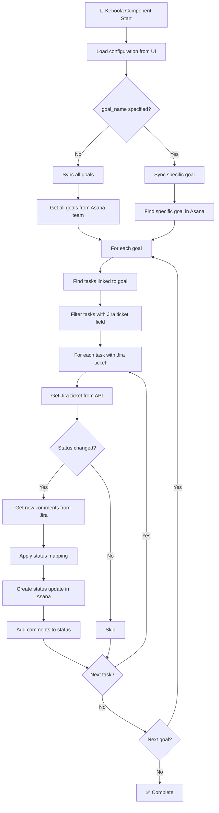

# Jira-Asana Sync for Keboola

🚀 **Goal-oriented synchronization between Jira tickets and Asana tasks running as a Keboola Custom Python Component**

## Description

This Keboola component automatically synchronizes Jira tickets with Asana tasks, featuring:

- ✅ **Automatic status updates** in Asana based on Jira changes  
- 🔄 **Status mapping** from Jira to Asana
- 💬 **Comment transfer** from Jira to Asana status updates
- 🔗 **Goal-oriented workflow** via Asana Goals
- 📊 **Configuration via Keboola UI**
- 🔐 **Encrypted parameter storage** for API tokens

## Configuration Parameters

### Required Parameters

#### Jira Configuration
- **`jira_base_url`** - Your Jira instance URL (e.g., `https://company.atlassian.net`)
- **`jira_project_key`** - Jira project key (e.g., `CFT`)
- **`jira_email`** - Your Jira email address
- **`jira_token`** - Jira API token (**encrypted parameter**)

#### Asana Configuration  
- **`asana_workspace_gid`** - Asana workspace ID
- **`asana_team_gid`** - Asana team ID
- **`asana_token`** - Asana Personal Access Token (**encrypted parameter**)

### Optional Parameters

- **`goal_name`** - Specific goal name to sync (if empty, syncs all goals)
- **`status_mapping`** - Custom status mapping object (uses defaults if not provided)

### Default Status Mapping

```json
{
  "To Do": "New",
  "In Progress": "In Progress",
  "Done": "Complete",
  "Blocked": "On Hold"
}
```

### Custom Status Mapping Example

```json
{
  "To Do": "New",
  "In Progress": "In Progress", 
  "Code Review": "In Progress",
  "Testing": "In Progress",
  "Done": "Complete",
  "Blocked": "On Hold",
  "Won't Do": "Complete"
}
```

## Keboola Configuration JSON Template

Copy this JSON template into your Keboola component configuration:

```json
{
  "jira_base_url": "",
  "jira_project_key": "",
  "jira_email": "",
  "#jira_token": "",
  "asana_workspace_gid": "",
  "asana_team_gid": "",
  "#asana_token": "",
  "goal_name": "",
  "status_mapping": {
    "To Do": "New",
    "In Progress": "In Progress", 
    "Done": "Complete",
    "Blocked": "On Hold"
  }
}
```

**Notes:**
- Fill in the empty strings with your actual values
- `goal_name` can be left empty to sync all goals
- `status_mapping` shows the default mapping (Asana status → Jira status)
- Mark `jira_token` and `asana_token` as **encrypted parameters** in Keboola

## How It Works

### Goal-Oriented Synchronization Process



## Sync Actions

### Test Connection

The component includes a **Test Connection** sync action that validates:
- ✅ Jira API connectivity and authentication
- ✅ Asana API connectivity and authentication  
- ✅ Access to specified Asana team and goals

## API Setup Guides

### Jira API Token

1. Go to https://id.atlassian.com/manage-profile/security/api-tokens
2. Create API token
3. Add as **encrypted parameter** in Keboola configuration

### Asana Access Token

1. Go to Asana → Profile Settings → Apps → Developer Apps
2. Create new Personal Access Token
3. Add as **encrypted parameter** in Keboola configuration

## Asana Status Types

The component automatically maps Jira statuses to Asana goal status types:

- `on_track` - everything going according to plan (green)
- `at_risk` - there are risks (yellow)  
- `off_track` - problems (red)
- `complete` - finished (green)

## Troubleshooting

### Common Issues

#### "Missing required parameter" error
- Check that all required configuration parameters are filled in the Keboola UI
- Ensure encrypted parameters (API tokens) are properly set

#### "Connection failed" error  
- Use the **Test Connection** sync action to verify API credentials
- Check API token permissions and expiration dates
- Verify workspace/team GIDs are correct

#### "No goals found in team"
- Verify the `asana_team_gid` is correct
- Check that the team has goals created in Asana
- Ensure API token has access to the specified team

#### "No Asana task found" 
1. Verify that Asana tasks have Jira ticket attachments (links to Jira tickets)
2. Ensure attachment names contain valid Jira ticket format (e.g., ABC-123)
3. Ensure tasks are linked to goals via Asana's Goal Relationships

## Requirements

- **Python 3.12+**
- **Keboola Custom Python Component** environment
- **Valid API access** to both Jira and Asana

## Development

### Local Development Setup

```bash
# Install UV: https://docs.astral.sh/uv/getting-started/installation/
uv sync

# Run locally (requires .env file for testing)
uv run python main.py
```

### Project Structure

```
├── main.py                 # Keboola component entry point
├── src/
│   ├── sync_manager.py     # Main synchronization logic
│   ├── jira_api.py         # Jira API integration
│   └── asana_api.py        # Asana API integration
├── pyproject.toml          # Modern Python project configuration
└── README.md              # This file
```

### Technology Stack

- **UV** for dependency management
- **Python 3.12+** with modern type hints
- **Keboola Component SDK** for platform integration
- **Requests** for HTTP API calls
- **python-dateutil** for timezone handling

## License

MIT License - feel free to modify and use for your projects! 