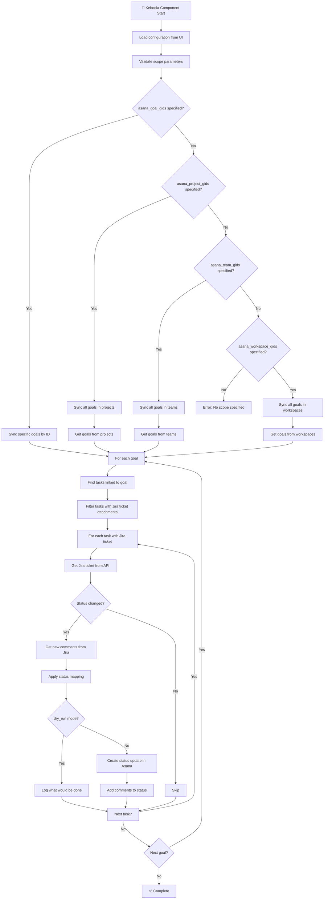

# Jira-Asana Sync for Keboola

🚀 **Goal-oriented synchronization between Jira tickets and Asana tasks running as a Keboola Custom Python Component**

## Description

This Keboola component automatically synchronizes Jira tickets with Asana tasks, featuring:

- ✅ **Automatic status updates** in Asana based on Jira changes  
- 🔄 **Status mapping** from Jira to Asana
- 💬 **Comment transfer** from Jira to Asana status updates
- 🔗 **Goal-oriented workflow** via Asana Goals
- 📊 **Configuration via Keboola UI**
- 🔐 **Encrypted parameter storage** for API tokens

## Configuration Parameters

### Required Parameters

#### Jira Configuration
- **`jira_base_url`** - Your Jira instance URL (e.g., `https://company.atlassian.net`)
- **`jira_email`** - Your Jira email address
- **`jira_token`** - Jira API token (**encrypted parameter**)

#### Asana Configuration  
- **`asana_token`** - Asana Personal Access Token (**encrypted parameter**)

#### Asana Scope (at least one required)
- **`asana_goal_gids`** - Specific goal IDs to sync (string or array)
- **`asana_project_gids`** - Project IDs - sync all goals in these projects (string or array)  
- **`asana_team_gids`** - Team IDs - sync all goals in these teams (string or array)
- **`asana_workspace_gids`** - Workspace IDs - sync all goals in these workspaces (string or array)

### Optional Parameters

- **`dry_run`** - Test mode that shows what would be done without making changes (default: false)
- **`status_mapping`** - Custom status mapping object (uses defaults if not provided)

### Default Status Mapping

```json
{
  "To Do": "New",
  "In Progress": "In Progress",
  "Done": "Complete",
  "Blocked": "On Hold"
}
```

### Custom Status Mapping Example

```json
{
  "To Do": "New",
  "In Progress": "In Progress", 
  "Code Review": "In Progress",
  "Testing": "In Progress",
  "Done": "Complete",
  "Blocked": "On Hold",
  "Won't Do": "Complete"
}
```

## Keboola Configuration JSON Template

Copy this JSON template into your Keboola component configuration:

```json
{
  "jira_base_url": "",
  "jira_email": "",
  "#jira_token": "",
  
  "asana_goal_gids": [],
  "asana_project_gids": [],
  "asana_team_gids": [],
  "asana_workspace_gids": [],
  
  "#asana_token": "",
  "dry_run": false,
  "status_mapping": {
    "To Do": "New",
    "In Progress": "In Progress", 
    "Done": "Complete",
    "Blocked": "On Hold"
  }
}
```

**Notes:**
- Fill in the empty strings with your actual values
- **At least one** of the `asana_*_gids` parameters must be specified
- Scope parameters can be strings or arrays: `"123456"` or `["123456", "789012"]`
- `dry_run: true` enables test mode without making changes
- `status_mapping` shows the default mapping (Jira status → Asana status)
- Mark `#jira_token` and `#asana_token` as **encrypted parameters** in Keboola

## Example Configurations

### 1. Sync Specific Goals Only
```json
{
  "jira_base_url": "https://mycompany.atlassian.net",
  "jira_email": "john.doe@company.com",
  "#jira_token": "your_jira_api_token_here",
  
  "asana_goal_gids": ["1210803030748387", "1210803030748388"],
  
  "#asana_token": "your_asana_personal_access_token_here",
  "dry_run": false
}
```

### 2. Sync All Goals in a Team
```json
{
  "jira_base_url": "https://mycompany.atlassian.net", 
  "jira_email": "john.doe@company.com",
  "#jira_token": "your_jira_api_token_here",
  
  "asana_team_gids": "123456789012345",
  
  "#asana_token": "your_asana_personal_access_token_here",
  "dry_run": false
}
```

### 3. Sync All Goals in Projects
```json
{
  "jira_base_url": "https://mycompany.atlassian.net",
  "jira_email": "john.doe@company.com", 
  "#jira_token": "your_jira_api_token_here",
  
  "asana_project_gids": ["987654321098765", "456789012345678"],
  
  "#asana_token": "your_asana_personal_access_token_here",
  "dry_run": false
}
```

### 4. Mixed Scope Configuration
```json
{
  "jira_base_url": "https://mycompany.atlassian.net",
  "jira_email": "john.doe@company.com",
  "#jira_token": "your_jira_api_token_here",
  
  "asana_goal_gids": "1210803030748387",
  "asana_team_gids": ["123456789012345", "234567890123456"],
  
  "#asana_token": "your_asana_personal_access_token_here",
  "dry_run": false
}
```

### 5. Custom Status Mapping
```json
{
  "jira_base_url": "https://mycompany.atlassian.net",
  "jira_email": "john.doe@company.com", 
  "#jira_token": "your_jira_api_token_here",
  
  "asana_team_gids": "123456789012345",
  
  "#asana_token": "your_asana_personal_access_token_here",
  "dry_run": false,
  "status_mapping": {
    "To Do": "New",
    "In Progress": "In Progress",
    "Code Review": "In Progress", 
    "Testing": "In Progress",
    "Done": "Complete",
    "Blocked": "On Hold",
    "Won't Do": "Complete"
  }
}
```

### 6. Test Configuration (Dry Run)
```json
{
  "jira_base_url": "https://mycompany.atlassian.net",
  "jira_email": "john.doe@company.com",
  "#jira_token": "your_jira_api_token_here",
  
  "asana_team_gids": "123456789012345",
  
  "#asana_token": "your_asana_personal_access_token_here",
  "dry_run": true
}
```

## How It Works

### Goal-Oriented Synchronization Process



## Sync Actions

### Test Connection

The component includes a **Test Connection** sync action that validates:
- ✅ Jira API connectivity and authentication
- ✅ Asana API connectivity and authentication  
- ✅ Access to specified Asana team and goals

## API Setup Guides

### Jira API Token

1. Go to https://id.atlassian.com/manage-profile/security/api-tokens
2. Create API token
3. Add as **encrypted parameter** in Keboola configuration

### Asana Access Token

1. Go to Asana → Profile Settings → Apps → Developer Apps
2. Create new Personal Access Token
3. Add as **encrypted parameter** in Keboola configuration

## Asana Status Types

The component automatically maps Jira statuses to Asana goal status types:

- `on_track` - everything going according to plan (green)
- `at_risk` - there are risks (yellow)  
- `off_track` - problems (red)
- `complete` - finished (green)

## Troubleshooting

### Common Issues

#### "Missing required parameter" error
- Check that all required configuration parameters are filled in the Keboola UI
- Ensure encrypted parameters (API tokens) are properly set

#### "Must specify at least one Asana scope" error
- At least one of these parameters must be filled: `asana_goal_gids`, `asana_project_gids`, `asana_team_gids`, or `asana_workspace_gids`
- Scope parameters can be strings or arrays of GIDs

#### "Connection failed" error  
- Use the **Test Connection** sync action to verify API credentials
- Check API token permissions and expiration dates
- Verify that specified GIDs are correct and accessible

#### "No goals found" error
- Verify that the specified GIDs (goal/project/team/workspace) are correct
- Check that the specified entities contain goals
- Ensure API token has access to the specified resources
- Use `dry_run: true` to see what goals would be found

#### "No Asana task found" 
1. Verify that Asana tasks have Jira ticket attachments (links to Jira tickets)
2. Ensure attachment names contain valid Jira ticket format (e.g., ABC-123)
3. Ensure tasks are linked to goals via Asana's Goal Relationships
4. Use `dry_run: true` to see what tasks are being found

#### Using Dry Run Mode
- Set `"dry_run": true` to test configuration without making changes
- Dry run will show what goals and tasks would be processed
- Use this to verify your scope configuration before running actual sync

## Requirements

- **Python 3.12+**
- **Keboola Custom Python Component** environment
- **Valid API access** to both Jira and Asana

## Development

### Local Development Setup

```bash
# Install UV: https://docs.astral.sh/uv/getting-started/installation/
uv sync

# Run locally (requires .env file for testing)
uv run python main.py
```

### Project Structure

```
├── main.py                 # Keboola component entry point
├── src/
│   ├── sync_manager.py     # Main synchronization logic
│   ├── jira_api.py         # Jira API integration
│   └── asana_api.py        # Asana API integration
├── pyproject.toml          # Modern Python project configuration
└── README.md              # This file
```

### Technology Stack

- **UV** for dependency management
- **Python 3.12+** with modern type hints
- **Keboola Component SDK** for platform integration
- **Requests** for HTTP API calls
- **python-dateutil** for timezone handling

## License

MIT License - feel free to modify and use for your projects! 